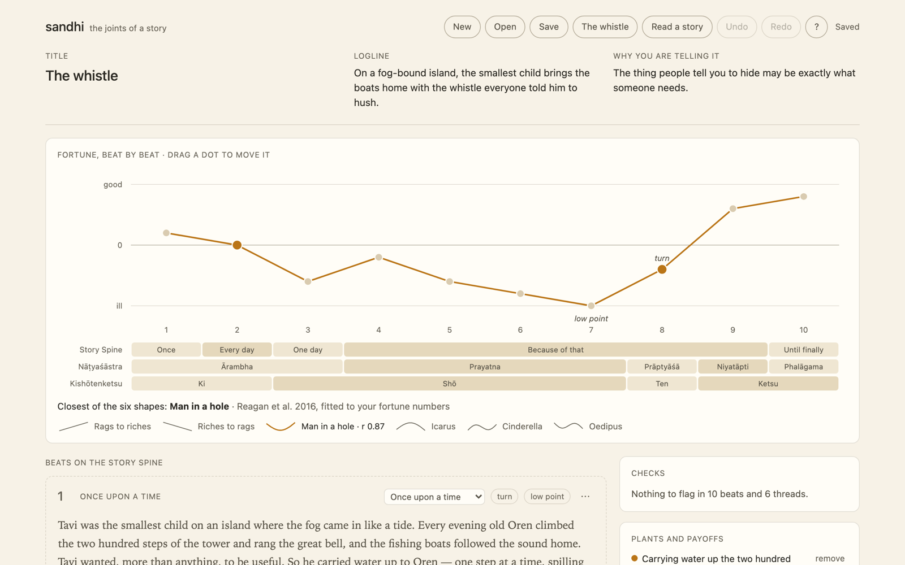

<h1 align="center">sandhi</h1>

<p align="center"><b>Any AI you choose marks your story's structure, in your own words. It never writes a sentence.</b></p>

<p align="center">One HTML file in your browser. No account, no server of ours, no telemetry.</p>

<p align="center">
  
  
  
  <a href="LICENSE"></a>
</p>

<p align="center"></p>

## Install

| Where | How |
|---|---|
| Any desktop browser | Open [sandhi.naklitechie.com](https://sandhi.naklitechie.com) |
| From source | `git clone https://github.com/NakliTechie/sandhi && cd sandhi && python3 -m http.server -b 127.0.0.1 8000`, then open `127.0.0.1:8000` |

It opens on *The whistle*, a ten-beat demo story, with a short tour. Move a beat's fortune, name the word that joins two beats, tag a principle, and the chart and the checks follow. **New** walks you through the Story Spine one question at a time; **Read a story** takes one you have written. An agent drives the same page:

```js
await window.sandhi.status()   // title, counts, checks by class, closest arc, undo depth
```

Nothing to install, no account. Your story autosaves in this browser, and **Save** writes a `.sandhi.json` file.

## Why

You can feel the middle of your story sag, but not where. The advice says every scene should turn, what you plant should pay off, the hero should earn the ending. Your draft is too close to see whether it does.

sandhi lays the story on its spine and shows its joints. Each beat has a fortune, a phase in three traditions (Story Spine, the Nāṭyaśāstra's five stages, kishōtenketsu), the word that joins it to the last (*therefore*, *but*, or a slack *and then*), and what it plants or pays off. The thirteen principles come from [How stories work](https://assets.chiragpatnaik.com/how-stories-work), which also shows where the masters disagree. *Sandhi* is the Nāṭyaśāstra's word for those joints.

## Read a story with the AI you choose

Paste a story or a chapter. A model marks its beats, turn, low point, joints and threads. It returns labels and exact quotes only; sandhi cuts your own text where each quote lands and drops any quote that does not match. You see the result before it replaces anything, and Undo brings your story back.

You choose who reads it, closest to you first: a model server on your machine (Ollama or LM Studio), Gemini Nano in Chrome, or your own provider and key (OpenRouter, OpenAI, Anthropic, Google Gemini, Groq, Mistral, DeepSeek, Together, or any OpenAI-compatible URL). Keys stay in this browser and show only as a fingerprint. Large models read structure well; small on-device ones do not yet (see *Verify it yourself*).

## Write on the spine

Every beat carries labels you set: its spine stage, fortune, joint, a turn or low-point mark, whether luck or the hero's choice moves it, and the principles it serves. The checks compare those labels and name the next step: an empty or idle beat, a slack joint, a plant that never pays off, a payoff with nothing planted, luck after the turn. They never guess from your prose.

## Commands

```bash
cd test && npm install                                            # Playwright and axe-core, for the gates
npm test                                                          # core · ladder · parity · face · a11y
node cli-read.mjs prompt <dir> --story gift-of-the-magi           # a reader-eval prompt (opt-in)
node cli-read.mjs score <reply> <name> --story gift-of-the-magi   # score a model's reply
node page-read.mjs --model qwen3.5:4b --story to-build-a-fire     # the real page reads with a local model
```

Agents: `window.sandhi` exposes 32 tools over one command bus, and `navigator.modelContext` gets the same where the browser has it. Accepting a reading, entering a key, and sending the story to a paid provider stay with the writer. Contract: [SPEC.md §0](SPEC.md).

## Verify it yourself

```bash
cd test && npm install && npm test
```

The gates refuse a demo story that does not match the explainer's data, a check with no test that fires it, a control with no tool behind it, a cold load over five seconds, an agent door that offers the accept or key tools or sends the story off the device on its own, and any serious accessibility violation. Reading quality is measured, not gated: on *The whistle* and three public-domain stories, codex `gpt-6-astra` and a Claude subagent marked the turn in all four with every quote matching the text, while a 4B local model found the turn in 5 of 12 reads, and Gemini Nano missed it in 8 of 8 and could not finish a 7,082-word story (table in [SPEC.md §5](SPEC.md)). The read dialog shows each reader's measured result.

## License

[MIT](LICENSE). · [SPEC.md](SPEC.md) · [llms.txt](llms.txt) · [How stories work](https://assets.chiragpatnaik.com/how-stories-work)
